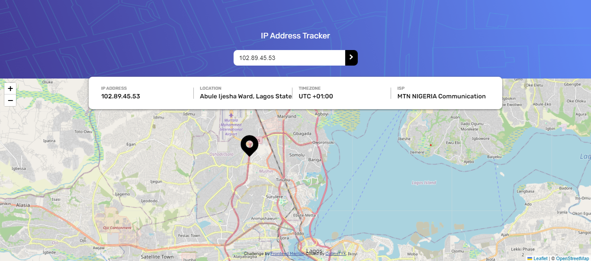
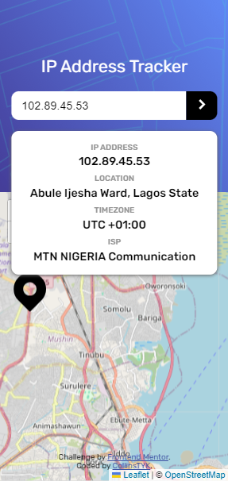

# Frontend Mentor - IP address tracker solution

This is a solution to the [IP address tracker challenge on Frontend Mentor](https://www.frontendmentor.io/challenges/ip-address-tracker-I8-0yYAH0). Frontend Mentor challenges help you improve your coding skills by building realistic projects.

## Table of contents

- [Overview](#overview)
  - [The challenge](#the-challenge)
  - [Screenshot](#screenshot)
  - [Links](#links)
- [My process](#my-process)
  - [Built with](#built-with)
  - [Continued development](#continued-development)
  - [Useful resources](#useful-resources)
- [Author](#author)
- [Acknowledgments](#acknowledgments)

## Overview

### The challenge

Users should be able to:

- View the optimal layout for each page depending on their device's screen size
- See hover states for all interactive elements on the page
- See their own IP address on the map on the initial page load
- Search for any IP addresses or domains and see the key information and location

### Screenshot

### Links

- Solution URL: [view solution](https://github.com/collinstyk/fem-ip-address-tracker)
- Live Site URL: [view Live Site](https://fem-ip-address-tracker.onrender.com/)

## My process

### Built with

- Semantic HTML5 markup
- CSS
- Flexbox
- Mobile-first workflow
- Object Oriented
- [Typescript](https://www.typescriptlang.org/docs/handbook/intro.html)

### Continued development

I need to improve in the area of version control with git and coding with typescript.

### Useful resources

- [w3schools](https://www.w3schools.com/typescript/index.php) - This helped me understand typescript.
- [MDN](https://developer.mozilla.org/en-US/) - This website cover most part of frontend development. Just search for anything relating to HTML5, CSS and JAVASCRIPT.
- [Typescript-Handbook](https://www.typescriptlang.org/docs/handbook/intro.html)

## Author

- Frontend Mentor - [@collinstyk](https://www.frontendmentor.io/profile/collinstyk)
- Twitter - [@dozie_jr](https://x.com/dozie_jnr?t=xoii2xr6b7fBUghaFEajnw&s=09)

### Acknowledgments

I will like to acknowledge [Jonas Schmedtmann](https://codingheroes.io/). His udemy course really gave alot of practical experiences.
